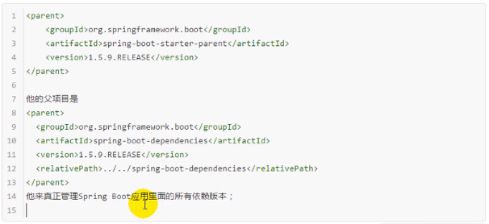
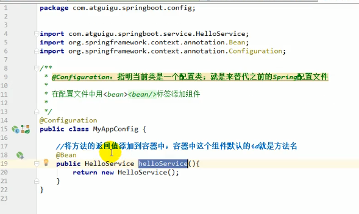

# java-sample-spring-boot-junior

## 课程介绍

​	第1至8章是spring boot基础。第9至16章是spring boot的高级知识。本次课只讲第1至8章。


## 正文

### 一、Spring Boot入门


​	官网：https://spring.io/

#### 1. SpringBoot简介

* 简化Spring应用开发的一个框架

- 整个Spring技术栈的一个大整合

- J2EE开发的一站式解决方案


#### 2. 微服务简介

​	微服务：一种架构风格。

​	一个应用应该是一组小型服务；相互之间可以通过HTTP方式进行互通。

​	每一个功能元素最终都是一个可独立替换和独立升级的软件单元。

```
一个描述微服务的网站：https://martinfowler.com/articles/microservices.html
```


​	单体应用缺点：有可能一个小小的修改，都会影响到整个系统。


#### 3. Hello World

​	需求：基于maven创建一个Spring Boot的hello world程序。

##### 3-1. 环境配置

1. JDK： 1.8

2. MAVEN： 3.5.4

   需要设置~/.m2/settings.xml

   1). 在mirrors中设置阿里云镜像

   ```xml
   <mirror>
       <id>alimaven</id>
       <name>aliyun maven</name>
       <url>http://maven.aliyun.com/nexus/content/groups/public/</url>
       <mirrorOf>central</mirrorOf>
   </mirror>
   ```

   2). 在profiles标签中设置maven编译环境

   ```xml
   <!-- 这段设置告诉maven用1.8的jdk来编译 -->
   <profile>
       <id>jdk-1.8</id>
       <activation>
           <actionByDefault>true</actionByDefault>
           <jdk>1.8</jdk>
       </activation>
       <properties>
           <maven.compiler.source>1.8</maven.compiler.source>
           <maven.compiler.target>1.8</maven.compiler.target>
           <maven.compiler.compilerVersion>1.8</maven.compiler.compilerVersion>
       </properties>
   </profile>
   ```

3. 设置IDEA的maven环境

   

##### 3-2. 创建spring boot

详情参考： **demo-01-hello**

3-3. 发布spring boot

1. 根据官方文档，创建一个可执行的jar包。需要将下面配置写入pom.xml

   ``` xml
   <build>
       <plugins>
           <plugin>
               <groupId>org.springframework.boot</groupId>
               <artifactId>spring-boot-maven-plugin</artifactId>
           </plugin>
       </plugins>
   </build>
   ```

2. 运行mvn package进行打包


3. 打包后会在target里面


4. 通过命令行可以直接启动


#### 4. pom.xml

##### 4-1. 父项目



​	SpringBoot的版本仲裁中心；

​	以后我们导入依赖，默认是不需要写版本的。 

##### 4-2. 导入的依赖


​	spring-boot-starter-xxx：spring boot的场景启动器

#### 5. 主入口类


​	这是一个组合注解


##### 5-1. @SpringBootConfiguration


##### 5-2. @EnableAutoConfiguration

 

 

 	

 #### 6. 配置文件

##### 6-1. 简介

 

 ##### 6-2. YAML配置文件

###### 6-2-1. 基本语法


###### 6-2-1. 值的写法


##### 6-3. 获取配置文件的值

详细参考： demo-02-yml

##### 6-4. @Value注解和@Configurationproperties注解的比较


##### 6-5. @PropertySource和@ImportSource：

**@Configurationproperties是在全局配置文件中获取值**


**@PropertySource：** 加载指定的配置文件


**@ImportSource：**

1. 创建helloService.java

   

2. 创建bean.xml

   

3. 标志在主配置类上

   

4. 输出结果

   

##### 6-6. @Bean

内容看注释



##### 6-7. 配置文件的占位符


##### 6-8. profile - 多环境支持


##### 6-9. 配置文件的加载位置


##### 6-10. 外部配置文件


